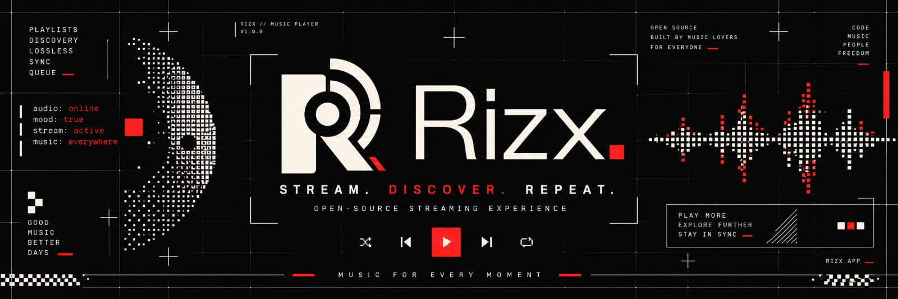
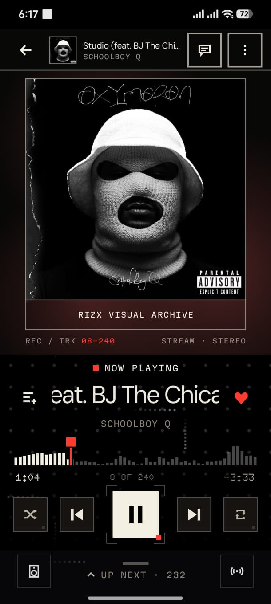
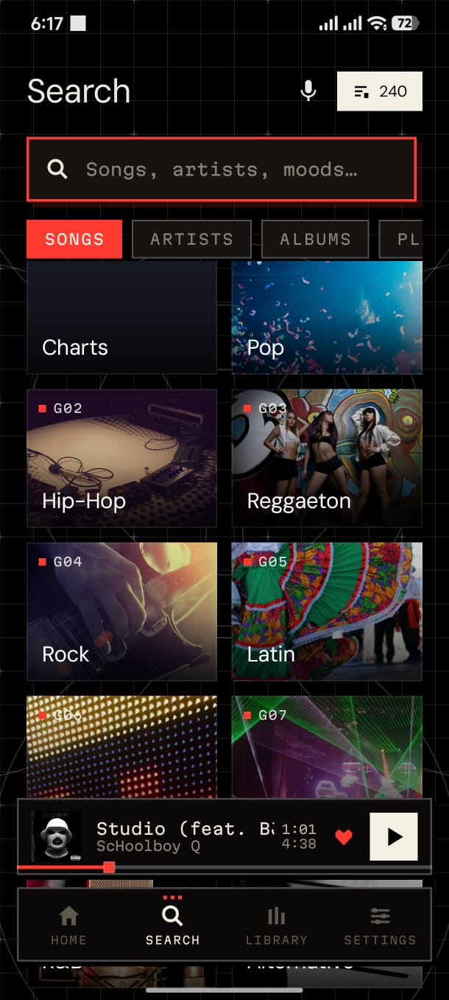
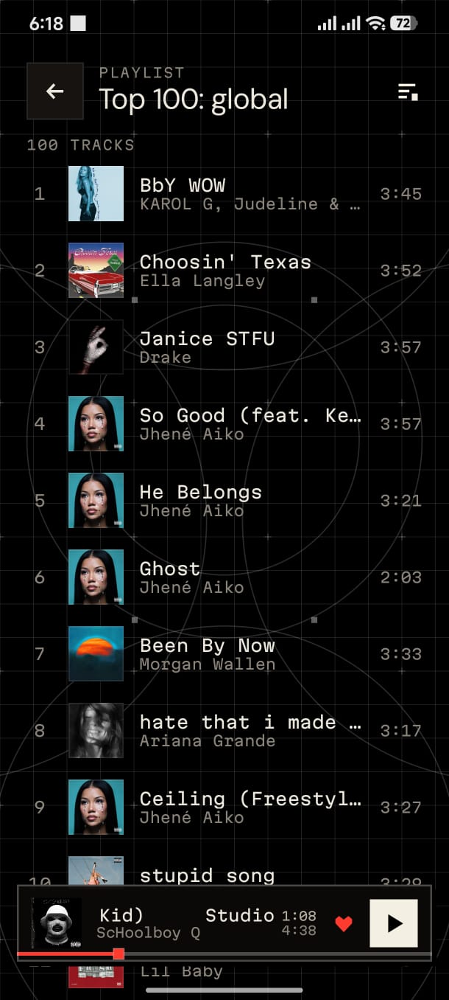
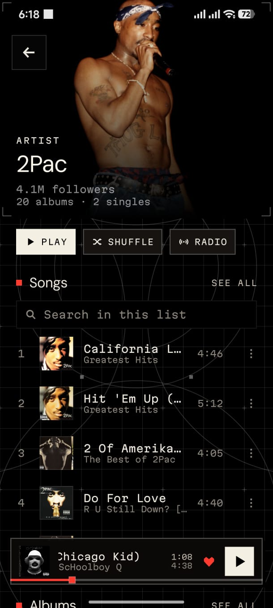
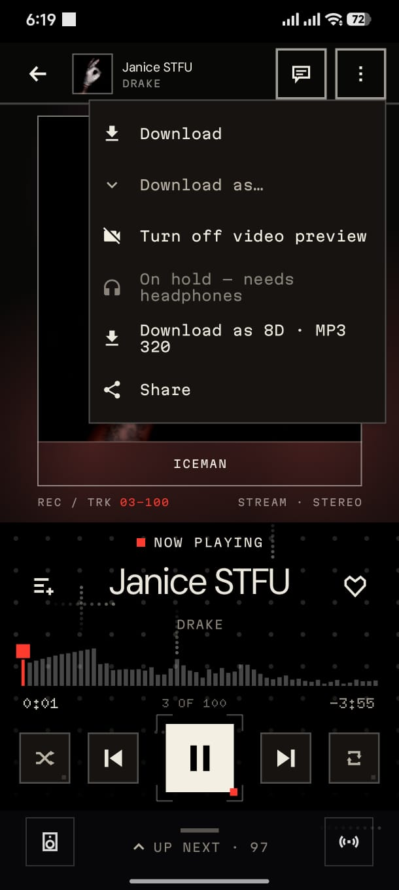
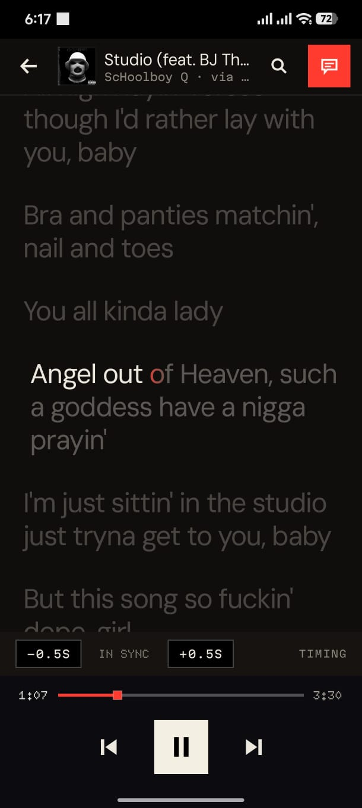
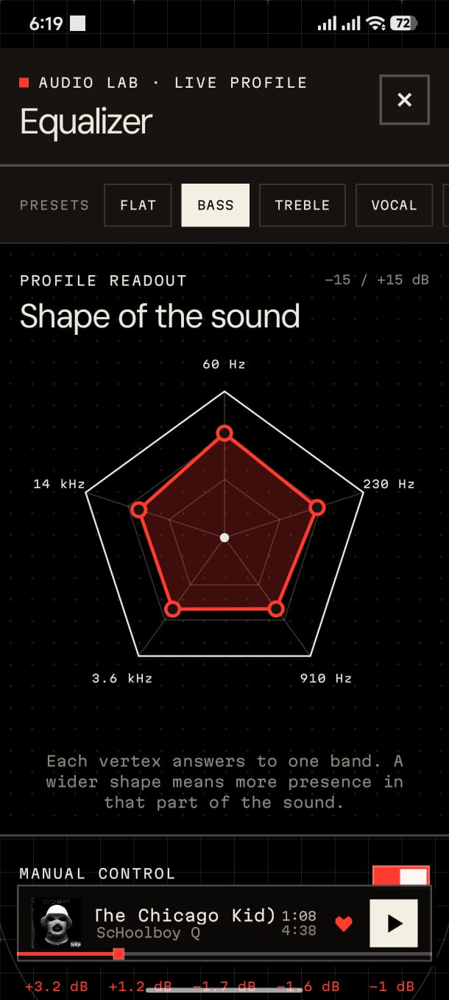
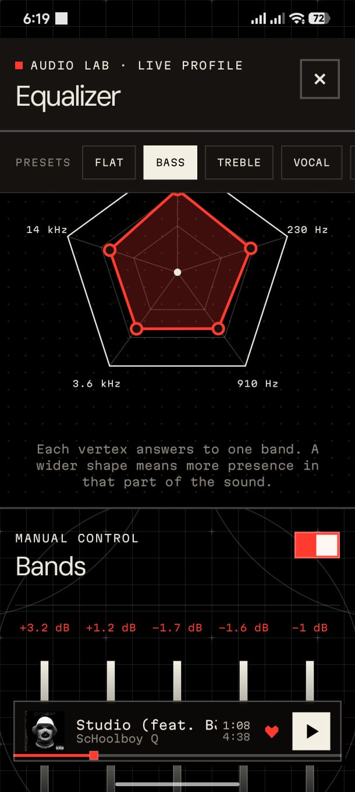
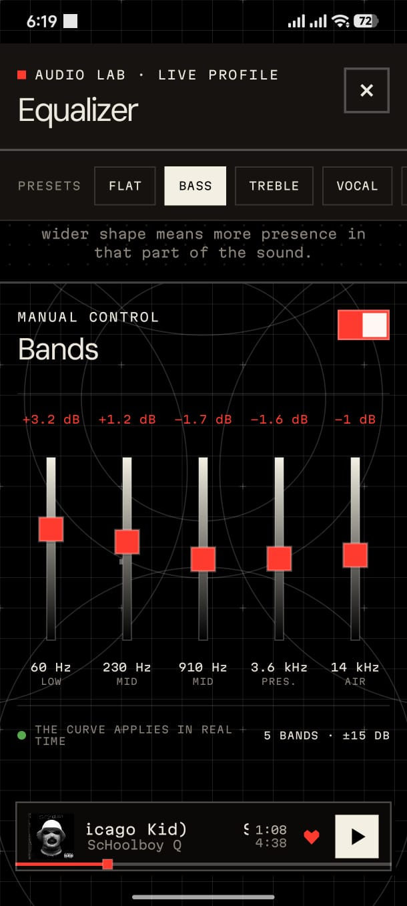

<div align="center">

<a href="https://github.com/UlisesFTP/Rizx-Music-Player">
  
</a>

<br>

<h1>Rizx Player</h1>
<h3>Stream. Discover. Repeat. — an open-source music player for Android</h3>

<p>
  <a href="https://github.com/UlisesFTP/Rizx-Music-Player/releases/latest"></a>
  <a href="https://github.com/UlisesFTP/Rizx-Music-Player/releases"></a>
  <a href="LICENSE"></a>
  <a href="https://github.com/UlisesFTP/Rizx-Music-Player/actions/workflows/android-ci.yml"></a>
</p>
<p>
  
  
  
  
  
</p>

</div>

<hr>

## 📖 Contents

- [🎵 About Rizx](#-about-rizx)
- [📸 Screenshots](#-screenshots)
- [✨ Features](#-features)
- [📲 Download & install](#-download--install)
- [🌐 Where the music comes from](#-where-the-music-comes-from)
- [🏗️ Architecture at a glance](#️-architecture-at-a-glance)
- [🛠️ Build from source](#️-build-from-source)
- [📚 Documentation](#-documentation)
- [🤝 Contributing & governance](#-contributing--governance)
- [🛡️ Privacy](#️-privacy)
- [📜 Disclaimer](#-disclaimer)
- [📄 License](#-license)
- [🙏 Credits](#-credits)

<hr>

## 🎵 About Rizx

<table width="100%">
  <tr valign="middle">
    <td width="62%" align="left">
      <p><b>Rizx</b> is a native Android music player built by music lovers, for everyone. It streams full-length songs from <b>free, keyless public sources</b>, plays the music already <b>on your phone</b>, works <b>offline</b> with tagged downloads, and runs real background playback through a <code>MediaSessionService</code> — with the design language of a piece of studio hardware: dot-matrix numerals, mono labels, hard frames, a red signal dot.</p>
      <p>No account is required. No API keys ship in the app. Nothing about what you listen to leaves the phone unless you choose to sign in and sync your library across devices.</p>
      <p><b>Code. Music. People. Freedom.</b></p>
    </td>
    <td width="38%" align="center">
      
    </td>
  </tr>
</table>

## 📸 Screenshots

<table align="center">
  <tr>
    <td align="center"><br><sub><b>Search</b> · genres, charts, five source tabs, voice</sub></td>
    <td align="center"><br><sub><b>Playlists</b> · editorial charts, imports, your own</sub></td>
    <td align="center"><br><sub><b>Artist page</b> · play, shuffle, radio, discography</sub></td>
  </tr>
  <tr>
    <td align="center"><br><sub><b>Now Playing</b> · live waveform, animated covers</sub></td>
    <td align="center"><br><sub><b>Player menu</b> · download in four formats, 8D, share</sub></td>
    <td align="center"><br><sub><b>Lyrics</b> · karaoke timing, word by word</sub></td>
  </tr>
  <tr>
    <td align="center"><br><sub><b>Equalizer</b> · the shape of the sound</sub></td>
    <td align="center"><br><sub><b>Presets</b> · Flat, Bass, Treble, Vocal and more</sub></td>
    <td align="center"><br><sub><b>Bands</b> · five faders, ±15 dB, live</sub></td>
  </tr>
</table>

## ✨ Features

### 🎧 Playback & sound
- **Real background playback** — one `MediaSessionService`-owned ExoPlayer, a system media notification, lock-screen controls, and **resume after process death** at the exact second.
- **Gapless & crossfade**, adaptive quality by network, an optional **Hi-Res mode** (Opus 160 kbps / 48 kHz, 32-bit float output, a live DAC readout), a fixed loudness boost.
- **Equalizer** with presets, five bands at ±15 dB and a radar readout — plus an **automatic equalizer** that derives a curve per song from its genre and its own measured spectrum.
- **Smart 8D audio** — adaptive headphone spatialization tuned per genre and refined from the recording itself; it stands down by itself over the speaker. Download any song as a standalone 8D MP3.
- **Two player layouts** (Classic and Compact), a live spectrum **waveform seek bar**, swipe-to-skip and double-tap-to-like, an **up-next drawer** that is a real queue manager, an output-device switcher, and ambient lights behind the cover in its own colours.

### 🔎 Discovery
- **Home feed** blended from Deezer, Apple Music, Spotify editorial and YouTube Music charts, with daily mixes, "Similar to…" rows, mood stations and a *For you* tab computed on-device.
- **Search** across Songs, Artists, Albums, Playlists and an *Underground* tab of YouTube/SoundCloud exclusives; a 28-genre browse wall where each tile opens a real **genre hub**.
- **Endless radio** from any song or artist, contextual Next/Prev that follows the album, artist or playlist you started from.
- **Audio ID** — identify what is playing around you. The fingerprint is computed on the phone; the audio never leaves it.

### 🎤 Lyrics & covers
- **Synced and karaoke lyrics** down to word and letter precision (LRCLIB, NetEase, KuGou, Musixmatch), a ±0.5 s timing control, and Original / Pronunciation / Translation readings.
- **Animated covers** — Apple Music motion artwork, TIDAL video covers, or the song's own muted music video.

### 📚 Library & offline
- Favorites, playlists, recently played, an in-list filter everywhere, and a **local music player** (MediaStore scan plus a permission-free file explorer).
- **Downloads in four formats** — Original, Opus, MP3 320, FLAC — every one with embedded cover and tags, segmented multi-connection fetching, and optional publishing into `Music/Rizx`.
- **Playlist import** by URL (Spotify, YouTube / YT Music, Deezer, Apple Music — paged to the end) or from JSON/CSV files; **export** as Rizx JSON, XSPF or M3U8; share as an unlisted link or QR.

### ☁️ Account & sync (optional)
- Sign in with Google or a passwordless e-mail code and your playlists, favorites and listening taste follow you to every device. Local-first: the phone stays the source of truth, other devices catch up in seconds while the app is on screen, and signing out keeps everything.

### 🧩 Widgets, plugins, updates
- **Three home-screen widgets** — a Nothing-style card with a tap-to-seek bar, a compact bar, and an Audio ID card.
- A **sandboxed plugin runtime** (QuickJS) that runs Nuclear-compatible plugins with per-plugin isolation and quarantine.
- **In-app updates** — the app watches this repository's releases, notifies you once per new version, downloads the APK, verifies it against the published SHA-256 and hands it to Android's installer.

### 🎨 Design
- A brutalist, editorial visual language shared with the web version: **DM Sans** display type, **Martian Mono** labels, **Doto** dot-matrix numerals, a warm *Paper* light theme and a near-black *Ivory* dark theme, semantic haptics, blueprint backgrounds. Four languages: English, Español, Português, Français.

The full tour, feature by feature: **[docs/FEATURES.md](docs/FEATURES.md)** · the manual: **[docs/USER_GUIDE.md](docs/USER_GUIDE.md)**.

## 📲 Download & install

1. Download the latest `Rizx-<version>-release.apk` from the
   **[Releases](https://github.com/UlisesFTP/Rizx-Music-Player/releases/latest)** page.
2. Open it on the phone. Android asks once to allow installs from your browser or file manager.
3. From then on the app **updates itself**: Settings › App › *App updates* checks this repository once a
   day, shows what changed, and installs the new version with one confirmation.

**Requirements:** Android 8.0 (API 26) or newer. No Google account, no Play Services required
(Google sign-in is optional and only used for the sync feature).

**Verify what you installed.** Every release asset carries the SHA-256 digest GitHub computes on
upload; compare it with `sha256sum Rizx-*.apk` (or `certutil -hashfile` on Windows). The APK is
signed with the project's release key, so Android refuses any file that was tampered with:

| | Release signing certificate |
|---|---|
| Subject | `CN=Rizx Player, OU=Rizx, O=UlisesFTP, C=MX` |
| SHA-256 | `D7:97:42:78:D0:51:B0:8D:44:89:5E:32:7D:6B:0E:B3:3B:E2:72:2A:45:F5:D1:C4:E4:DA:44:67:C0:1E:8A:95` |
| SHA-1 | `3E:21:33:EF:D3:4C:35:30:73:41:4D:8E:07:23:7F:B2:61:15:DB:06` |

Check it with `apksigner verify --print-certs Rizx-*.apk`. Prefer a third-party updater?
[Obtainium](https://github.com/ImranR98/Obtainium) can track this repository's releases too.

> A build you compiled yourself is signed with your own key and will not update over the published
> one (Android blocks cross-signature updates). Uninstall one before installing the other.

## 🌐 Where the music comes from

Every source is **public and keyless** — no API keys, tokens or secrets ship in the app, and no
access control is defeated to get in.

| Source | Used for |
|---|---|
| **Deezer** | Catalogue search, charts, genres, artist radio, playlist import |
| **Audius** | Full-length streaming of independent music |
| **YouTube / YouTube Music**, **SoundCloud** | Full-length audio and Underground picks through [NewPipeExtractor](https://github.com/TeamNewPipe/NewPipeExtractor); charts; playlist import |
| **Apple / iTunes** | Search, editorial playlists and Top 100 charts, animated covers |
| **Spotify** (public embeds only) | Editorial charts and playlist import by URL — never search |
| **TIDAL** | Animated video covers |
| **LRCLIB · NetEase · KuGou · Musixmatch · lyrics.ovh** | Synced, word-timed and prose lyrics |
| **Wikipedia** | Artist biographies |
| **GitHub** | The release list the updater reads |

Details, capabilities and limits per source: **[docs/PROVIDERS.md](docs/PROVIDERS.md)**.

## 🏗️ Architecture at a glance

```
UI (Compose) → ViewModel → UseCase → Repository / Controller → Provider · Room · DataStore · Media3
```

- **`domain/`** — pure Kotlin: models, provider and repository contracts, use cases. No Android imports.
- **`data/`** — providers (Deezer, Audius, Apple, YouTube, SoundCloud, lyrics…), Room and DataStore
  stores, DTO↔domain mappers, the download pipeline, canvas, sync, recognition, updates, the plugin runtime.
- **`playback/`** — `PlaybackService : MediaSessionService` owns the single ExoPlayer; the stream
  resolver, audio effects, the spatial engine and the PCM taps live here.
- **`ui/`** — Compose screens, the editorial design system, navigation. Talks to ViewModels only.

Two rules carry most of the weight: **`ProviderRef(provider, id)` is the identity of everything** (never
a title or a URL), and **stream resolution is two-phase and just-in-time** — a resolved URL is
ephemeral and is never stored. The whole map, package by package, with the flows drawn out:
**[docs/TECHNICAL_GUIDE.md](docs/TECHNICAL_GUIDE.md)**.

```
Rizx-Music-Player/
├─ Proyecto/                 # the Android app — open this folder in Android Studio
│  ├─ app/                   # the :app module (496 Kotlin files, 202 JVM test files)
│  │  ├─ schemas/            # exported Room schemas (committed, migrations are provable)
│  │  └─ src/main/java/fm/rizx/player/{core,domain,data,playback,widget,ui}
│  └─ baselineprofile/       # startup-profile generator
├─ docs/                     # user guide, technical guide, governance, context, policies, assets
├─ share-site/               # static files for a share-link domain (App Links + landing page)
├─ .github/                  # CI workflow, issue and pull-request templates
├─ AGENTS.md · CONTRIBUTING.md · SECURITY.md · CODE_OF_CONDUCT.md
└─ LICENSE · NOTICE          # GPL-3.0
```

## 🛠️ Build from source

Use **JDK 21** for Gradle (17–23 work; Java 25 does not) and an Android SDK with `compileSdk 36`.

```bash
git clone https://github.com/UlisesFTP/Rizx-Music-Player.git
cd Rizx-Music-Player/Proyecto
./gradlew assembleDebug          # debug APK — no configuration needed
./gradlew testDebugUnitTest      # 1,695 JVM tests, no device needed
./gradlew lintDebug
./gradlew assembleRelease        # needs your own keystore (see docs/BUILD.md)
```

A clean clone builds a fully working player. The optional account/sync/share features need a backend
of your own, configured by a handful of *public* values passed at build time — see
**[docs/BUILD.md](docs/BUILD.md)**.

## 📚 Documentation

| For… | Read |
|---|---|
| **Listeners** | [User guide](docs/USER_GUIDE.md) — every screen, control, setting and limitation · [Features](docs/FEATURES.md) |
| **Developers** | [Technical guide](docs/TECHNICAL_GUIDE.md) — the map of the code, layer by layer · [Architecture](docs/ARCHITECTURE.md) · [Providers](docs/PROVIDERS.md) · [Build](docs/BUILD.md) |
| **Contributors & agents** | [AGENTS.md](AGENTS.md) — standing instructions · [Governance](docs/GOVERNANCE.md) — roles, workflow, definition of done, decision log · [Context](docs/CONTEXT.md) — where the project stands · [Contributing](CONTRIBUTING.md) |
| **Plugin authors** | [Plugin guide](docs/plugins/PLUGIN_GUIDE.md) · [Plugin spec for agents](docs/plugins/PLUGIN_SPEC_FOR_AGENTS.md) |
| **Everyone** | [Privacy policy](docs/PRIVACY_POLICY.md) · [Licensing](docs/LICENSING.md) · [Third-party licenses](docs/THIRD_PARTY_LICENSES.md) · [Security policy](SECURITY.md) |

The index of all of it: **[docs/README.md](docs/README.md)**.

## 🤝 Contributing & governance

Rizx is developed slice by slice under **Spec → Plan → Implement → Test → Report**. The rules that
keep it from becoming a black box are written down and enforced:

- [`docs/GOVERNANCE.md`](docs/GOVERNANCE.md) — who decides what, the definition of done, the
  architecture invariants and *where each one is pinned*, the release rules, the decision log.
- [`docs/CONTEXT.md`](docs/CONTEXT.md) — the current state of the project and its dated running log.
- [`AGENTS.md`](AGENTS.md) — the short standing instructions for anyone touching the code, human or
  coding agent. Point your agent at it first; you remain the author.
- [`CONTRIBUTING.md`](CONTRIBUTING.md) — setup, the gate, pull-request checklist.

Bugs and ideas go to the [issue tracker](https://github.com/UlisesFTP/Rizx-Music-Player/issues)
(templates included); security problems follow [`SECURITY.md`](SECURITY.md).

## 🛡️ Privacy

- **No tracking, no analytics, no ads.** The app has no telemetry of any kind.
- Listening history, taste, recognition history, downloads and the queue stay **on the phone**.
- Sync is **opt-in** and local-first; it carries playlists, favorites and aggregate taste — never
  downloads, local files, stream URLs or recognition history.
- The microphone opens only for the seconds you ask for in Audio ID; audio is fingerprinted in memory
  and discarded.
- The one automatic request is the daily update check against this repository's public release list.

The full policy: **[docs/PRIVACY_POLICY.md](docs/PRIVACY_POLICY.md)**.

## 📜 Disclaimer

Rizx is an independent open-source project. It is **not affiliated with, endorsed by or connected to**
Deezer, Audius, YouTube, Google, SoundCloud, Apple, Spotify, TIDAL, Musixmatch or any other service it
reads from. Content is fetched at runtime from those services' public endpoints under their own terms;
the app bundles no third-party content, keys or assets, and defeats no access control. Availability of
any source depends on that source. Use it responsibly and respect the rights of artists and services.

## 📄 License

Rizx Player is free software under the **GNU General Public License v3.0** — see
[`LICENSE`](LICENSE) and [`NOTICE`](NOTICE). The Corresponding Source of every release is this
repository at the release tag, and the in-app About screen links back here.

The GPL covers the code. The name **Rizx**, the logomark and the app icon are reserved: fork freely,
but ship your fork under its own name and icon. Details in
[`docs/LICENSING.md`](docs/LICENSING.md).

## 🙏 Credits

Rizx stands on the shoulders of these projects:

- [**NewPipeExtractor**](https://github.com/TeamNewPipe/NewPipeExtractor) (GPL-3.0) — keyless YouTube and SoundCloud extraction.
- [**AndroidX Media3 / ExoPlayer**](https://github.com/androidx/media) — the playback engine.
- [**quickjs-kt**](https://github.com/dokar3/quickjs-kt) — the sandboxed JavaScript runtime behind plugins.
- [**jaudiotagger**](https://www.jthink.net/jaudiotagger/) and [**jump3r**](https://github.com/Sciss/jump3r) — tag writing and the on-device MP3 encoder.
- [**SongRec**](https://github.com/marin-m/SongRec) — the documented fingerprint format Audio ID is a port of.
- [**Nuclear**](https://github.com/nukeop/nuclear) — the plugin API shape and playlist file format Rizx stays compatible with.
- The type: [DM Sans](https://github.com/googlefonts/dm-fonts), [Martian Mono](https://github.com/evilmartians/mono) and [Doto](https://github.com/AdrienLeka/Doto), all under the SIL Open Font License.

And every listener who reports a bug, translates a string or plays a song. The complete dependency
list with licenses: [`docs/THIRD_PARTY_LICENSES.md`](docs/THIRD_PARTY_LICENSES.md).

<div align="center">
  <br>
  <sub>Made with ❤️ for music lovers everywhere · <b>music for every moment</b></sub>
</div>
