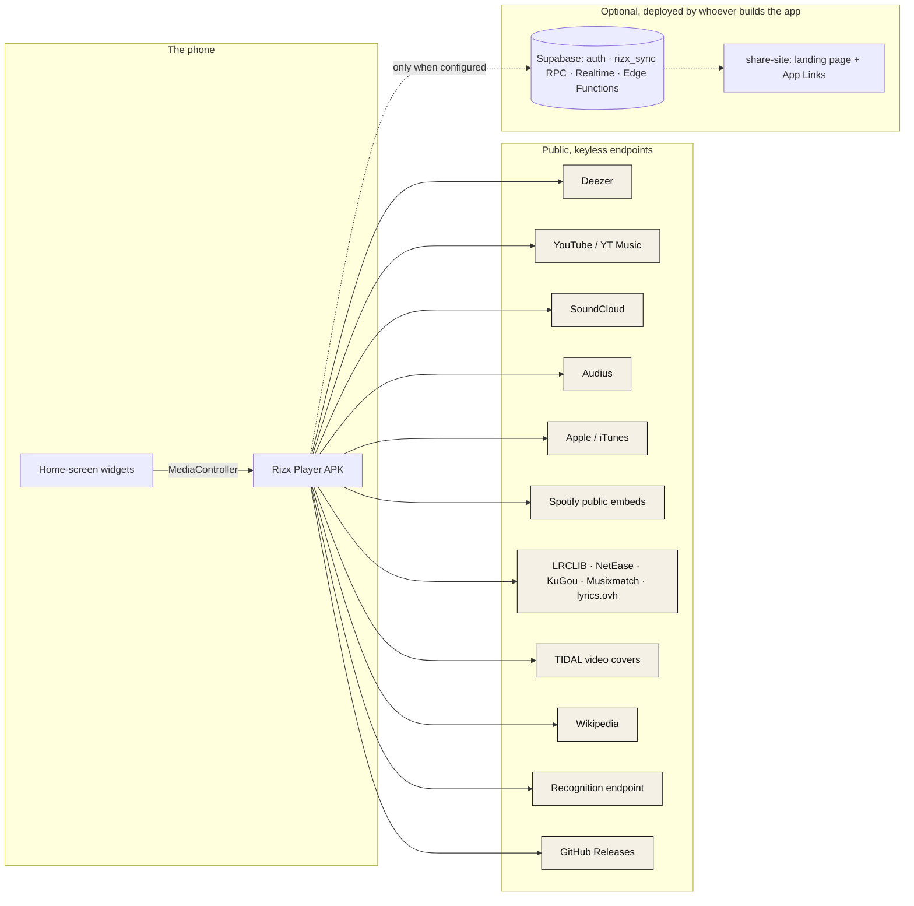
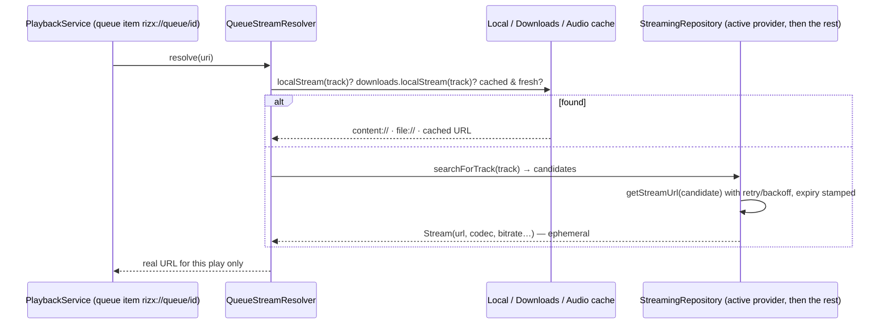
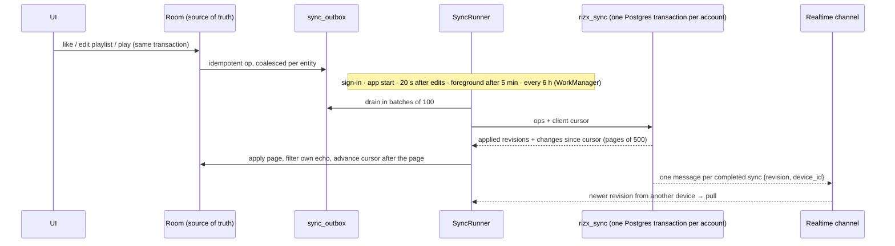
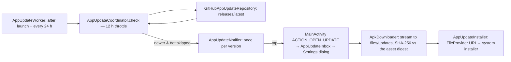

# Rizx Player — technical guide

_Verified against the working tree on 2026-09-13 · Rizx Player 1.0.0 (versionCode 3) · Room schema 7._

This is the map of the code: what the app is made of, how the pieces depend on each other, how a tap
becomes sound, where every kind of state lives, and how the project is built, tested and released. It
is written for a developer — human or coding agent — who has never opened the repository. The
shorter, older documents go deeper on single topics and are linked where they apply:
[`ARCHITECTURE.md`](ARCHITECTURE.md) (the load-bearing rules and the DSP), [`PROVIDERS.md`](PROVIDERS.md)
(every content source), [`BUILD.md`](BUILD.md) (the toolchain and signing), [`plugins/`](plugins/)
(the plugin contract). The rules of the project — who decides, what "done" means — are in
[`GOVERNANCE.md`](GOVERNANCE.md); the product as the listener sees it is [`USER_GUIDE.md`](USER_GUIDE.md).

## Contents

1. [What Rizx Player is](#1-what-rizx-player-is)
2. [Repository layout](#2-repository-layout)
3. [Layers and the dependency rule](#3-layers-and-the-dependency-rule)
4. [The domain model](#4-the-domain-model)
5. [Providers and stream resolution](#5-providers-and-stream-resolution)
6. [The playback pipeline](#6-the-playback-pipeline)
7. [Lyrics](#7-lyrics)
8. [Audio ID (recognition)](#8-audio-id-recognition)
9. [Downloads and local music](#9-downloads-and-local-music)
10. [Home, recommendations and radio](#10-home-recommendations-and-radio)
11. [Account, sync and sharing](#11-account-sync-and-sharing)
12. [Plugins](#12-plugins)
13. [In-app updates](#13-in-app-updates)
14. [Home-screen widgets](#14-home-screen-widgets)
15. [The UI](#15-the-ui)
16. [Persistence](#16-persistence)
17. [The network stack](#17-the-network-stack)
18. [Configuration, build variants and dependencies](#18-configuration-build-variants-and-dependencies)
19. [Testing](#19-testing)
20. [Releasing](#20-releasing)
21. [Security posture](#21-security-posture)
22. [Known limits and debt](#22-known-limits-and-debt)
23. [Glossary](#23-glossary)

---

## 1. What Rizx Player is

A single-module native Android application (`fm.rizx.player`, Kotlin 2.0, Jetpack Compose, Hilt,
Media3/ExoPlayer, Room, DataStore, Retrofit/OkHttp, WorkManager) that:

- **streams full-length music from keyless public sources** — Deezer for the catalogue, YouTube and
  SoundCloud through NewPipeExtractor, Audius, Apple/iTunes — with the metadata source and the
  streaming source kept separate, so the app can search one catalogue and play from another;
- **plays the phone's own music** (MediaStore scan and a permission-free file explorer) through the
  same pipeline;
- **works offline** with tagged downloads in four formats and an identity-keyed audio cache;
- runs **real background playback** from a `MediaSessionService` that owns the one audio player;
- adds lyrics (line, word and letter timed), an automatic and a manual equalizer, adaptive 8D
  spatialization, animated covers, song recognition, on-device recommendations, home-screen widgets,
  a sandboxed plugin runtime, an optional local-first cloud sync, and self-updates from GitHub Releases.

Topology, from the phone outward:



Nothing in the public group needs a key; the app ships none. The optional group is a separate
deployment (`supabase/` holds its migrations and functions, untracked) that the app reaches only when
five *public* configuration values are passed at build time; without them the account screens hide
and everything else works.

A sibling project, **Rizx Web**, is the browser and desktop version; it shares the domain model as its
wire contract (see §11) and the editorial design language (see §15).

## 2. Repository layout

```
Rizx-Music-Player/
├─ Proyecto/                       # the Android Studio project — open THIS folder
│  ├─ app/                         # the :app module
│  │  ├─ build.gradle.kts          # variants, signing gate, BuildConfig names, dependencies
│  │  ├─ schemas/…/RizxDatabase/   # exported Room schemas 4.json … 7.json (committed)
│  │  └─ src/
│  │     ├─ main/java/fm/rizx/player/
│  │     │  ├─ core/               # DI modules, network stack, errors, cache, region (22 files)
│  │     │  ├─ domain/             # models, contracts, use cases — pure Kotlin (117 files)
│  │     │  ├─ data/               # providers, remote clients, stores, repositories,
│  │     │  │                      #   downloads, lyrics, canvas, sync, recognition, plugins, update (213)
│  │     │  ├─ playback/           # PlaybackService, resolver, effects, spatial DSP, caches (33)
│  │     │  ├─ widget/             # RemoteViews widgets (10)
│  │     │  ├─ ui/                 # Compose screens, ViewModels, design system, navigation (99)
│  │     │  ├─ MainActivity.kt · RizxApplication.kt
│  │     ├─ main/res/              # values{,-es,-pt,-fr}/strings_*.xml, font/, xml/, drawables
│  │     ├─ main/assets/plugin-runtime/   # bootstrap.js, domparser.min.js, sucrase.min.js
│  │     ├─ main/assets/plugins/   # git-ignored: bundled plugin archives, none in a clone
│  │     ├─ test/                  # 202 JVM test files (mirror the package tree)
│  │     └─ androidTest/           # 5 instrumented test files
│  ├─ baselineprofile/             # com.android.test module: startup profile generator
│  ├─ build.gradle.kts · settings.gradle.kts · gradle.properties (public) · gradlew
├─ docs/                           # everything that is not code (index: docs/README.md)
│  ├─ assets/                      # README banner and screenshots
│  └─ plugins/                     # plugin author guide and agent spec
├─ share-site/                     # static files a share-link host must serve
├─ .github/                        # CI workflow, issue and PR templates
├─ AGENTS.md · CONTRIBUTING.md · SECURITY.md · CODE_OF_CONDUCT.md
├─ LICENSE (GPL-3.0) · NOTICE · README.md
└─ .gitignore                      # what stays private: keys, keystore, private specs, agent context
```

Numbers on 2026-09-13: 496 main Kotlin files (about 69,000 lines) in 90 packages, 202 JVM test files
with 1,695 tests in 193 suites, 5 instrumented test files, 862 English strings in 21 files per locale.

## 3. Layers and the dependency rule

```mermaid
flowchart TB
  UI[ui/ — Compose screens · ViewModels · design system]
  DOM[domain/ — models · contracts · use cases  (no Android imports)]
  DATA[data/ — providers · remote clients · stores · repositories]
  PB[playback/ — PlaybackService · resolver · effects · DSP]
  CORE[core/ — DI modules · network stack · errors]
  WID[widget/ — RemoteViews]
  UI --> DOM
  DATA --> DOM
  PB --> DOM
  WID --> DOM
  CORE -. wires .-> DATA & PB & UI
  UI -. never .-> DATA
  UI -. never .-> PB
```

| Layer | Depends on | Rule |
|---|---|---|
| `domain/` | nothing Android | Models, provider/repository contracts, use cases. No `android.*`, Media3, Retrofit, Room or DTO imports. Everything here is JVM-testable. |
| `data/` | `domain` | Implements the contracts: providers over remote clients, Room/DataStore/file stores, mappers, repositories. DTOs never leave their `data/remote/<source>` package. |
| `playback/` | `domain` + Media3 | `PlaybackService` owns the single audio ExoPlayer; the stream resolver, effects, taps and the spatial engine live here. |
| `ui/` | `domain` (through ViewModels) | Compose. Never calls a provider, a repository implementation, a network client or a player. |
| `widget/` | `domain` + the media session | Drives playback through a short-lived `MediaController`; owns no player. |
| `core/` | — | Hilt modules (14, all `SingletonComponent`), the OkHttp/Retrofit stack, `AppError`, the cache manager, the region resolver. |

The arrow points inward only. Two consequences that shape everything else: the domain can be tested
without a device (the recognition fingerprint, the spatial DSP, the sync engine and the lyrics
matchers all run on the JVM), and a screen cannot reach past its ViewModel to a provider — which is
how failure isolation is guaranteed structurally rather than by discipline.

## 4. The domain model

`domain/model` (36 files) is the vocabulary the whole app speaks.

- **`ProviderRef(provider, id, url?)`** — the identity of every upstream thing (`deezer:12345`,
  `youtube:dQw4w9WgXcQ`, `local:8801`). A plain class, not a data class, so `equals`/`hashCode` use
  `provider + id` only; `url` is carried for convenience and excluded from identity.
  `identityKey = "$provider:$id"` is the string every cache and index is keyed by.
- **`Track`** — has **no id**: its identity is `source: ProviderRef`. `artists` are `ArtistCredit`s
  (name, roles, optional `source`), `album` is a light `AlbumRef`, `artwork` an `ArtworkSet`,
  `durationMs` milliseconds, timestamps ISO-8601 strings. `streamCandidates` is transient resolution
  state; `stripResolutionState()` removes it before anything is persisted or sent.
- **`PlaybackQueue`** — `List<QueueItem>` + `currentIndex` + `repeatMode` + `shuffleOn` +
  `unshuffledIds` + `QueueContext(kind, label, radioSeed, radioMode)`. **`QueueItem.id` is a
  per-insertion UUID**, distinct from the track's identity, so a song can sit twice in the queue and
  reorder/remove keep the cursor valid. `QueueSourceKind` (`ALBUM`, `ARTIST`, `PLAYLIST`, `LIKED`,
  `RECENTS`, `DOWNLOADS`, `LOCAL`, `RADIO`, `MANUAL`) drives contextual next/previous and radio refill.
- **`Playlist` / `PlaylistItem`** — a playlist has its own id; items have their own ids and store the
  track as JSON (`TrackJson`, resolution state stripped). Imported playlists can be read-only.
- **`Lyrics`** — `LyricLine(timeMs, text, words, endMs, romanized, translated)`,
  `LyricWord(startMs, endMs, text)`, `LyricsSyncType { PLAIN, LINE_SYNCED, WORD_SYNCED }`; an empty
  line text is a meaningful instrumental gap.
- **`AppUpdate` / `SemanticVersion`** — a published build and the SemVer-2.0 comparison of its tag.
- Enums that are settings: `ThemeMode`, `PlayerLayout { CLASSIC, COMPACT }`, `AudioQualityMode`
  `{ STANDARD, BEST_AVAILABLE, LOSSLESS_PREFERRED }`, `DownloadFormat { ORIGINAL, OPUS, MP3, FLAC }`,
  `RadioMode { ARTIST, YOUTUBE, APPLEMUSIC, SOUNDCLOUD }`, `LyricsDisplayMode`, `LyricsVisualQuality`,
  `CanvasQuality`, `CanvasNetworkPolicy`, `SpatialAudioMode`.

`domain/repository` (17 contracts) and `domain/provider` (14 files) are the seams; `domain/usecase`
(16 files) holds the pure logic — `StreamingResolver`, `TasteProfile`, `MixBuilder`, `RecsBlender`,
`AutoEqCurves`, `SmartSpatialProfiles`, `ArtistNameMatching`, `RecordingIdentity` (in `domain/match`).
Smaller contract packages: `lyrics`, `playback`, `recognition`, `lossless`, `canvas`, `plugin`,
`update`, `sync`, `share`, `account`.

The domain is also the **wire contract** of the sync feature: rows written by any client (the phone,
Rizx Web, an import) are decoded with kotlinx.serialization into these models, so `AlbumRef.source`,
`ArtistRef.source` and `PlaylistRef.source` being non-null is a rule other writers must respect. A row
this build cannot decode is skipped (`TrackJson.decodeTrackOrNull`), never thrown from a Flow.

## 5. Providers and stream resolution

Two contracts, deliberately separate (`domain/provider`):

```kotlin
interface MetadataProvider : ProviderDescriptor {          // what to play
    val searchCapabilities: Set<SearchCapability>
    suspend fun search(params: SearchParams): SearchResults
    suspend fun albumDetail(source: ProviderRef): Album? = null
    suspend fun artistDetail(source: ProviderRef): Artist? = null
    suspend fun radioTracks(seed: Track): List<Track> = emptyList()
    suspend fun playlistTracks(source: ProviderRef): List<Track> = emptyList()
}
interface StreamingProvider : ProviderDescriptor {         // how to play it
    suspend fun searchForTrack(track: Track): List<StreamCandidate>   // phase 1
    suspend fun getStreamUrl(candidate: StreamCandidate): Stream      // phase 2, ephemeral
}
```

Further kinds: `LyricsProvider`, `DashboardProvider` (charts and feed sections), `PlaylistProvider`
(import by URL), `DiscoveryProvider`; `CanvasProvider` and the recognition provider are deliberately
**outside** the registry (they are not interchangeable catalogues).

**The registry.** `ProviderRegistry` (`DefaultProviderRegistry`) is keyed by id and grouped by
`ProviderKind`. Metadata, streaming and lyrics are *single-active, first-wins* (defaults: Deezer,
YouTube, LRCLIB — persisted in DataStore and reconciled at start by `ProviderModule`); dashboards and
playlist importers fan out. A provider that throws fails alone: repositories wrap each call and
degrade to empty. The full source table, with what each does and how it stays keyless, is
[`PROVIDERS.md`](PROVIDERS.md).

**Two-phase, just-in-time resolution.**



- `domain/usecase/StreamingResolver.kt` is the pure orchestration (candidate reuse while fresh,
  exponential backoff, expiry from `PlaybackResolverSettings`); `data/repository/StreamingRepositoryImpl.kt`
  dispatches active-first with a native-owner shortcut (a YouTube-sourced track goes straight to the
  YouTube provider).
- `playback/service/QueueStreamResolver.kt` is the Media3 seam: a `ResolvingDataSource.Resolver` that
  maps placeholder items to URLs, caches by `identityKey` (survives timeline rebuilds), prefetches the
  neighbours on an IO scope (skipped under data saver), and clears itself when the Hi-Res setting flips.
- **A resolved URL is never persisted** — not in playlists, favorites, the session snapshot, exports
  or sync documents. Only the identity is durable.
- **Keyless means public, not merely reachable.** A public API or a token a page hands to every
  visitor is fine; Spotify search sits behind an anti-bot token and is therefore absent, while Spotify
  playlists import through the public embed. Rate limits that exist are per feature, not global:
  recognition 1 s between calls, Musixmatch fetched only on explicit demand, plugin calls gated by a
  single-permit semaphore, downloads by two semaphores.

## 6. The playback pipeline

**Ownership.** `playback/service/PlaybackService.kt` is a `MediaSessionService` (exported, as Media3
requires) that owns the **single audio ExoPlayer**, the `MediaSession` and the media notification.
The UI drives it through `PlaybackController` — implemented by `MediaControllerPlaybackController`
over a `MediaController` — and never sees the player. The player holds the **whole queue** as a
timeline of placeholder `MediaItem`s (`rizx://queue/<id>`, `mediaId = QueueItem.id`), so
notification, lock screen and headset next/previous work natively while each item is resolved just in
time by `QueueStreamResolver`.

**From a tap to sound.**

```mermaid
flowchart LR
  T[Tap a row] --> VM[ViewModel]
  VM --> QR[QueueRepository: items + context]
  QR --> PC[PlaybackController]
  PC -- MediaController --> PS[PlaybackService]
  PS --> EP[ExoPlayer timeline of placeholders]
  EP --> QSR[QueueStreamResolver]
  QSR --> DS[ResolvingDataSource → CacheDataSource → HTTP / file]
  DS --> DEC[Decoder]
  DEC --> TAP[PcmTappingAudioSink: waveform · AutoEQ · spatial analysis]
  TAP --> SP[SpatializingAudioSink: Smart 8D]
  SP --> SINK[DefaultAudioSink, float output when Hi-Res]
  SINK --> AT[AudioTrack → session Equalizer + LoudnessEnhancer]
```



**Cache and buffering.** `playback/cache/AudioCache.kt` is a Media3 `SimpleCache` in `cacheDir/audio-cache`
keyed by `"<provider:id>#<codec>"` — never by URL, because URLs rotate — with a
`ProtectedLruCacheEvictor` that spares liked songs, a `CacheCompleter` that finishes half-played songs
on Wi-Fi, and a `CachedAudioReader` that lets a download copy from the cache. Size comes from the
"Offline cache" setting (default 512 MB). `DefaultLoadControl` drops its maximum buffer to 15 s under
data saver. A fully cached song never resolves a URL, which is what makes cached playback work offline.

**Effects.** `AudioEffects` binds the platform `Equalizer` to the audio session and is the single
actuator shared with `AutoEqualizer` (auto curves are applied through `beginAuto`/`applyAutoCurve`/`endAuto`
and never overwrite the manual curve); `LoudnessEnhancer` implements "Normalize volume" as a fixed
gain. The sink chain is `PcmTappingAudioSink(SpatializingAudioSink(DefaultAudioSink))`: the tap feeds
the Now Playing waveform, the spectrum measured for AutoEQ and the spatial analyzer without any
`RECORD_AUDIO` permission; the spatializer is the 8D stage. Both **wrap the sink** rather than being
`AudioProcessor`s, because `DefaultAudioSink` drops custom processors on the float (Hi-Res) path.
`AudioQualityMode` is one enum for codec preference and float output; `LOSSLESS_PREFERRED` asks the
community FLAC resolver first (§12). The spatial engine (`playback/spatial`, pure Kotlin, JVM-tested)
is described in depth in [`ARCHITECTURE.md` § Smart 8D audio](ARCHITECTURE.md#smart-8d-audio-adaptive-spatialization).

**Crossfade and gapless** are one position-driven volume envelope, not two players: crossfade on →
2,000 ms; else gapless off → a 350 ms fade; else native gapless with zero overhead. Re-evaluated every
75 ms. The web version implements the identical envelope.

**Persistence and restore.** A low-frequency ticker writes `filesDir/playback_session.json`
(`PlaybackSessionStore`: queue, cursor, repeat mode, position; tracks stripped of resolution state).
On start the service consumes it once, restoring index and position paused — so the app reopens on
the same second without ever storing a stream URL.

**Notification and widgets.** Media3 supplies the foreground notification and media buttons; the
custom layout adds favorite and repeat (`PlaybackActions`). Every transition pushes a `WidgetSnapshot`
to the widgets (§14).

**Canvas.** The one exception to "one player": `playback/canvas/CanvasPlaybackController.kt` owns a
second, **muted, video-only** ExoPlayer that renders on a `TextureView` behind the cover. Sources in
priority order (`CanvasModule`): Apple motion artwork → TIDAL video cover → the song's YouTube music
video, behind a policy gate (`domain/canvas/CanvasGate`: unmetered network, quality cap, battery
saver, RAM class, data saver, per-source toggles) and an **anti-static filter** that rejects uploads
that are really still images. Resolution results live in a memory cache (hit / miss 20 min / error
2 min); the media cache is URL-keyed on purpose and LRU-bounded (96 MB). A single `CanvasViewModel`
above navigation arbitrates the surface between the Home hero and Now Playing.

## 7. Lyrics

Five sources are registered as `LYRICS` providers — LRCLIB, NetEase (`yrc`), KuGou (`krc`),
Musixmatch (`richsync`), lyrics.ovh — and `LyricsRepositoryImpl` resolves in three steps: the user's
pinned pick, the disk cache (`filesDir/lyrics.json`, which is also what makes downloaded songs
readable offline), then **all providers raced concurrently** under a per-provider timeout, the first
word-timed hit ending the race. Every candidate passes `domain/lyrics/LyricsTrackMatcher`: version
words (`live`, `remix`, `acoustic`…) are a hard gate, everything else a lowest-wins score over title,
artist, album and duration, with `ArtistNameMatching` so a YouTube channel credit matches a lyrics
database's artist. Results are cached at the tier they achieved (a degraded fallback never shadows a
better source later) and the cache is versioned so a matcher fix invalidates old answers.

Parsers live in `data/lyrics` (`LrcParser`, `YrcParser`, `KrcParser` — base64+zlib+XOR —,
`RichSyncParser`), all funnelled through one `LyricsNormalizer`. Readings (`LyricsDisplayMode`:
original, pronunciation, translation) are stitched **by timestamp, never by index**
(`LyricReadings`), because NetEase's romanized document omits credit lines; the device can romanize
locally through ICU (`DeviceRomanizer`). The karaoke renderer (`ui/lyrics`) runs on a smooth
interpolating clock (`domain/playback/SmoothPosition`) rather than polling, sweeps a line letter by
letter in two passes over one layout (`WordSweepText`), and stores the per-track timing offset in
the lyrics store.

## 8. Audio ID (recognition)

`microphone → PCM → fingerprint → service → RecognitionMatch → resolver → Track → normal playback`.
Four seams behind `domain/recognition` contracts (`MicrophoneRecorder`, `RecognitionProvider`,
`RecognitionTrackResolver`, `RecognitionRepository`), deliberately outside `ProviderRegistry`.

- `AndroidMicrophoneRecorder` asks for 16 kHz mono first; `Pcm16Resampler` (windowed sinc) only when
  a device refuses. Nothing is written to storage; cancelling releases the microphone immediately.
- `ShazamSignatureGenerator` is a port of the wire format documented by SongRec (2048-point FFT every
  128 samples, Hann window, peak spreading, four bands, CRC32-framed) with **no Android imports**, so
  the whole format is covered by JVM tests.
- `ShazamRecognitionClient` uses a derived OkHttp client with no cache; `ShazamRecognitionProvider`
  holds the policy (one request at a time, 1 s floor, bounded retries, a five-minute memo keyed by the
  SHA-256 of the fingerprint).
- `DefaultRecognitionTrackResolver` climbs a ladder: ISRC on Deezer → Apple id on iTunes (verified) →
  a scored search (`RecognitionMatcher` over `RecordingIdentity`); below threshold it returns `null`
  and the screen offers a search instead of a wrong song.
- `RecognitionRepositoryImpl` is a singleton session with a generation number, so rotation or a trip
  to Settings rejoins a capture in progress and a stale answer cannot overwrite a newer one. History
  is a Room table capped at 200 rows; it stores titles and ids, never audio or fingerprints.

## 9. Downloads and local music

**Downloads** (`data/download`, wired in `DownloadsModule`):

```
segmented fetch → (MP3 transcode | Opus remux) → tag write → index → (MediaStore export)
```

- `TrackDownloader` sends the first request as a range; a `206` proves ranges work and already
  carries chunk one, a `200` falls back to a single stream. The remainder is fetched as 2 MiB chunks
  by up to `maxWorkers` workers (one on a bad signal) into a pre-sized file through positioned
  `FileChannel` writes, each chunk retrying its remaining range. It uses the `@DownloadHttp` client.
- Formats (`DownloadFormat`): **Original** (bytes as delivered — M4A from YouTube, MP3 from Audius),
  **Opus** (WebM → Ogg Opus remux, no re-encode; API 29+), **MP3 320** (pure-Java LAME via jump3r,
  decoded with `MediaCodec`), **FLAC** (a verified community file when the index has one, else
  Original). `AudioTagWriter` embeds cover, artist, album and year in every container; the Ogg Opus
  comment header is written by an in-repo page-level tagger (`OggOpusTagger`).
- Every step after the fetch is best-effort: a failed conversion or tag write never turns a good
  download into a failed one. The index (`filesDir/downloads.json`, completed downloads only, keyed
  by `Track.source`) is a file rather than Room because it is read synchronously on ExoPlayer's
  loader thread.
- `MediaStoreExporter` copies into the shared `Music/Rizx` at the user's opt-in; API 26–28 need the
  legacy write permission, requested at opt-in. `DownloadService` (foreground, `dataSync`) publishes
  one aggregate notification for a batch. 8D renders are a **separate** store and folder
  (`SpatialRenderRepository`), never a `DownloadFormat`, so choosing 8D cannot change what
  "downloaded" plays.

**Local music** (`data/local/media`, `LocalLibraryModule`): a MediaStore scan (`LocalLibraryRepository`)
maps `_ID` to `ProviderRef("local", id)`; a Storage-Access-Framework explorer (`SafAudioRepository`,
`SafFolderPlanner`) plays picked files and whole folders with no permission at all. Both resolve to
`content://` URLs with `protocol = FILE` and play through the same pipeline, so favorites, playlists,
queue and recents work identically for local files.

## 10. Home, recommendations and radio

- **Feed.** Four `DashboardProvider`s fan out concurrently in `DashboardRepositoryImpl` — Deezer
  charts, Spotify (public embed Top 50 / Viral 50), Apple (RSS most-played plus 20+ country Top 100s
  discovered from the browse page), SoundCloud "New & hot" — plus YouTube Music charts; each section
  is isolated, so a slow source degrades to empty. `BlendingDashboardRepository` applies
  `RecsBlender` (cross-source dedup where the Deezer copy wins, then weighted fair-queue interleave).
  The feed source selector narrows to one platform without touching the registry.
- **Stale-while-revalidate.** `HomeFeedStore` (`filesDir/home_feed.json`) renders the last Home
  immediately and revalidates underneath; a cold Home costs roughly seventy round-trips, a warm one
  none. Rows announce themselves from local taste before any network call so the layout does not jump.
- **Taste.** `recently_played` in Room is a listening log (plays, completions, skips, listened time,
  daypart buckets). `TasteProfile` weighs `recency × engagement × daypart (+ like)` with a
  half-life; `MixBuilder` builds up to three daily mixes per taste cluster from data already on the
  phone — **a mix costs no network call**. "For you" rows (`ForYouRepositoryImpl`) seed YouTube Music
  autoplay from the user's tracks and Deezer artist radio / related artists. Regional rows are
  consent-gated; the country comes from SIM → network → locale, no permission, no location.
- **Radio.** `GetRadioTracksUseCase` and `GetYoutubeMixTracksUseCase` feed the queue's auto-refill
  (`RADIO_REFILL_AHEAD = 2`, `RADIO_MAX_QUEUE = 200`); engines are keyed by `RadioMode` (YouTube
  Music mix, Apple, SoundCloud, with Deezer artist radio as the fallback every mode degrades to).
- **Genre browsing** addresses a catalogue genre **id**, never a name search; the hub derives its
  artists from the genre's own charting tracks because the source's per-genre artist list is not
  genre-filtered.

## 11. Account, sync and sharing

Optional, local-first, and absent from a build without configuration.



- **Auth** — `SupabaseAuthApi` (OTP, verify, token, signup, logout) behind `SupabaseAuthGateway`;
  the UI currently offers **Google** through Credential Manager (the e-mail-code path exists in the
  data layer). Tokens are sealed with an Android-Keystore AES-GCM key in the `account_session` DataStore.
- **The outbox model** — every local mutation writes its Room row and its `sync_outbox` operation in
  the same transaction (`*WithJournal` DAO methods), one pending op per entity. Types: `PLAYLIST`,
  `FAVORITE`, `TASTE`.
- **`SyncRunner`** — backfill, drain, apply; echo filtering; a 30-day `sync_recovery` snapshot before
  a dirty local playlist is replaced; a drop after `MAX_ATTEMPTS`. `SyncScheduler` decides *when*;
  `WorkManagerSyncCoordinator` + `RizxSyncWorker` are the backstop.
- **Realtime invalidation** — a plain OkHttp WebSocket to the backend's Phoenix endpoint, joined
  privately with the user's JWT, open only while a screen is visible. The message carries no data.
- **Taste adds up per device** — this phone's counters stay in `recently_played`; other devices' land
  in `taste_contributions`; the app sums on read, so no device overwrites another's history. Taste
  uploads pause on a metered link under data saver.
- **Sharing** — `PlaylistShareRepository` creates unlisted snapshots through the `playlist-shares` Edge
  Function (30-day links for a signed-in user, 7-day for a guest; the server stores only a token
  hash, so the local `playlist_shares.json` is the way back to your own link). Links come in two
  spellings — `https://<share host>/<token>` (App Links) and `rizx://share/<token>` — and land in
  `ShareLinkInbox`, which the Library consumes and imports. QR codes are generated with ZXing.
  `share-site/` is what a share host must serve (landing page with an "Open in Rizx" intent,
  `assetlinks.json`).
- **Never uploaded** — downloads, local paths and URIs, stream candidates, the queue, settings,
  detailed history, recognition history, plugins, provider credentials. Every cloud payload and
  portable export passes the same sanitizer.
- The backend — five migrations (schema and RLS, the `rizx_sync` RPC with an advisory lock per
  account, the Realtime policy) and four Edge Functions (`playlist-shares`, `guest-claim`,
  `account-delete`, legacy `sync`) — lives in `supabase/`, **untracked**, and is a separate
  deployment that a fork provides for itself.

## 12. Plugins

`data/plugin` is a sandboxed host for Nuclear-compatible JavaScript plugins.

- **Engine** — one QuickJS VM (`quickjs-kt`) on a single dedicated thread; a 128 MB allocation limit
  that throws instead of taking the process down; a 10 MB body cap enforced *during* a plugin fetch;
  a 30 s call timeout; `restart()` abandons a wedged thread and builds a fresh VM (a non-allocating
  CPU loop cannot be pre-empted — a documented limit of the alpha runtime).
- **Host bridge** — a fixed set of `__rizx_*` functions (log, register, sleep, fetch, kv, open
  external, random, HMAC, digest, ytdlp) guarded by a per-session host token injected before the
  bootstrap and removed after it, so plugin code cannot forge host calls. `fetch` allows http(s) only,
  refuses credentialed URLs and resolves through a guarded DNS that rejects private, loopback and
  link-local addresses on every redirect hop. `Shell.openExternal` is foreground-only and
  rate-limited. `Ytdlp` is a facade over the native NewPipe extractor — no binary.
- **Admission and quarantine** — `PluginCallGate` (single permit, a queue budget separate from the
  call budget; losing the queue race is not charged to the plugin); `JsPluginRuntime` counts
  consecutive failures per plugin and unregisters its providers at five, recorded as `QUARANTINED`
  until the user re-enables it.
- **Isolation between plugins** — each plugin's `api` is closed over its own id, provider ids are
  derived by the host as `<pluginId>:<descriptorId>` (a plugin can never take a built-in provider's
  place), and per-plugin KV lives under `filesDir/plugins`.
- **Bridges** — `Js{Metadata,Streaming,Lyrics,Dashboard,Playlist,Discovery}Provider` through one
  `JsProviderInvoker`; bad rows from a plugin are dropped, never fatal.
- **Install** — registries (the official one first, user-added ones merged, first wins on collision),
  zip limits (20 MB archive, 40 MB unpacked, 8,192 entries), on-device TypeScript transpilation
  (Sucrase in its own short-lived VM). The store hides entries a native provider already covers and
  ones with no host to reach. The repository bundles **no** plugin archives (`assets/plugins/` is
  git-ignored); a build that carries one seeds it at first launch. The community lossless (FLAC)
  index is itself a plugin — `data/lossless` matches strictly, inspects the real FLAC header with a
  64 KiB ranged request, and refuses private addresses.

The contract for authors: [`plugins/PLUGIN_GUIDE.md`](plugins/PLUGIN_GUIDE.md); the same as exact
shapes for agents: [`plugins/PLUGIN_SPEC_FOR_AGENTS.md`](plugins/PLUGIN_SPEC_FOR_AGENTS.md).

## 13. In-app updates

Outside a store an app cannot replace itself silently; the flow ends in Android's own installer sheet.



- The release tag is parsed as a `SemanticVersion` and compared with `BuildConfig.VERSION_NAME`; a
  404 (no release yet) is a normal state. The `.apk` asset that says `release` wins; any asset named
  `releaseTest`, `debug` or `test` is never offered (debug-signed, it could not install over the real
  key). GitHub's per-asset `sha256` digest is what the download is verified against; a release
  without one falls back to a size check, and Android's signature check still stands behind both.
- One `StateFlow<AppUpdateState>` (`Unknown · Checking · UpToDate · Available · Downloading · Ready ·
  Failed`) serves the worker, the Settings row, the dialog and the notification. The last answer, the
  skipped version and the notified version live in their own DataStore (`app_update`); a whole
  downloaded file is `Ready` again on the next launch.
- `REQUEST_INSTALL_PACKAGES` is declared; the first install needs the user's one-time "install
  unknown apps" grant, which the dialog drives and re-checks on resume.
- The release-day contract is in §20.

## 14. Home-screen widgets

Three `RemoteViews` widgets (`widget/`): the 4×2 card (cover, dot-matrix title, clock, a red
dotted seek bar of 24 tap zones over one bitmap, transport, ♥, microphone), the 4×1 bar, and the
2×2 Audio ID card that keeps the last recognised song with a play button. `PlaybackService` pushes a
`WidgetSnapshot` on every transition and a 5-second ticker; when the service is not running the
updater renders the on-disk playback snapshot, so the widgets show the last song with the app
closed. Taps broadcast to `WidgetActionReceiver` (not exported), which connects a short-lived
`MediaController` to the session — there is never a second player. Titles are drawn into bitmaps with
the dot-matrix face because `RemoteViews` cannot load a custom typeface.

## 15. The UI

**Navigation.** One activity (`MainActivity`, `singleTask`), one `NavHost` in `ui/RizxApp.kt`, routes
in `ui/navigation/Routes.kt`. Four bottom tabs — Home, Search, Library, Settings — each with its own
back stack; Now Playing, Queue and Lyrics slide vertically and hide the mini-player.

| Route | Screen | Shows |
|---|---|---|
| `home` | `HomeScreen` | Tabbed feed (All, For you, Songs, Playlists, Albums, Artists), mosaics, hero |
| `search?q=` | `SearchScreen` | Search with five source tabs, suggestion pills, the genre wall, Audio ID entry |
| `library?tab=` | `LibraryScreen` | All, Playlists, Liked, Downloads, Recent, Local |
| `settings` | `PreferencesScreen` | Eight searchable sections; consumes the pending-update request |
| `now_playing` · `queue` · `lyrics` | `NowPlayingScreen` · `QueueScreen` · `LyricsScreen` | The player, the full queue, karaoke lyrics with their own transport |
| `album_detail/{provider}/{id}` · `artist_detail/…` · `editorial_playlist/…` · `genre/{id}` · `moods` · `station/…` | detail screens | Album, artist (bio, discography, similar), remote playlist, genre hub, all stations, one station |
| `playlist_detail/{playlistId}` | `PlaylistDetailScreen` | A user playlist: filter, download all, export/share sheet |
| `local` · `local_album/{id}` · `local_artist/{id}` | `LocalLibraryScreen` + details | Songs, Playlists, Albums, Artists, Files |
| `recognition` | `RecognitionScreen` | The Audio ID state machine and history |
| `equalizer` · `sources` · `account` · `about` · `licenses` | one screen each | Equalizer, plugins, account, About, open-source licences |

External entry points: the App Link and `rizx://share/<token>` (→ `ShareLinkInbox`), the widget
microphone (`ACTION_RECOGNIZE` → `RecognitionInbox`), the update notification (`ACTION_OPEN_UPDATE`
→ `AppUpdateInbox`), and widget button broadcasts. Each inbox is a one-slot handoff a screen consumes.

**ViewModels** (22, one per surface) expose `StateFlow`s and take events; `PlayerViewModel` holds
app-wide playback and theme state, `PlaybackViewModel` is the seam over `PlaybackController`,
`CanvasViewModel` arbitrates the single video surface, `AppUpdateViewModel` mirrors the coordinator.

**The design system.** `ui/theme/Color.kt` is a token data class (`RizxTheme.colors`, ~40 tokens,
no hex in screens): *Ivory* dark (pitch-black ground, warm cards, cream text, red `#FF3B2F`) and
*Paper* light (warm ivory paper, ink text, red `#DE2A1E`). `ThemeMode` (System / Light / Dark) is
resolved in `MainActivity`. Type (`ui/theme/Type.kt`): **DM Sans** for display text — the family is
bundled in three optical sizes because Compose fixes variable axes per `Font`, and `sg(size)` picks
the nearest —, **Martian Mono** (narrowed to `wdth 88`) for every label and body (`mr()`, `code()`),
**Doto** for dot-matrix numerals (`dot()`); Manrope is kept only for revert. `ui/components/Editorial.kt`
is the editorial vocabulary shared with Rizx Web — kickers, signal-dot eyebrows, display titles,
2dp ink frames with a hard offset shadow (red on dark), index tags, segmented tabs, the search field
— and `Decor.kt` the motifs: blueprint grid and construction circles behind every screen, hatch,
dot grid, corner brackets, `brutalShadow`. `RizxIcons` is a custom 24×24 brutalist icon set (heavy
fills, butt caps, miter joins). Haptics (`RizxHaptics`) are semantic — tick, select, confirm, heavy,
error, toggle — over `performHapticFeedback`, no `VIBRATE` permission.

**Now Playing** has two layouts (`PlayerLayout`): Classic (full-bleed cover with corner brackets,
floating toolbar, actions on their own row) and Compact (the web's ink stage: toolbar, framed cover
that takes every dp the controls leave, caption band, `REC / TRK` record line, heading flanked by
add-to-playlist and like). Three ambient lights in the cover's own colours (Palette, scored by
population × saturation) drift behind the cover from a 55 ms ticker, never a per-frame canvas, and
freeze under reduced motion. The waveform eases toward the analyser's reading per display frame
while playing (attack 55 ms, release 170 ms).

**Localization.** English (default), Spanish, Portuguese, French, declared in `locales_config.xml`;
on API 33+ the OS owns the per-app locale, below it `AppLanguage` wraps the base context. Strings are
split into ~21 files per locale by area.

**Responsive.** Phones stay portrait (`applyOrientationPolicy`); tablets and unfolded foldables
(`sw ≥ 600dp`) get landscape and a two-pane player. `LocalBottomInset` carries the measured height
of the floating chrome; font scale is clamped to 1.15 on that chrome only.

## 16. Persistence

**Room** — `RizxDatabase` (`rizx.db`, version 7, exported schemas 4–7 committed; every bump ships its
`Migration`, JSON and instrumented test together):

| Table | Key | Holds |
|---|---|---|
| `favorites` | `(type, provider, sourceId)` | Liked tracks, albums, artists as JSON |
| `playlists` · `playlist_items` | `id` · `id` + `playlistId` | User and imported playlists; items carry `trackJson`, `sortOrder`, `note` |
| `recently_played` | `(provider, sourceId)` | The listening log: plays, completions, skips, ms listened, daypart counters |
| `recognition_history` | `id` | Audio ID occasions (title, ids, cover URL, resolved track) — never audio |
| `sync_outbox` · `sync_state` · `sync_recovery` | `operationId` · `accountId` · `id` | Pending idempotent ops · cursor and device id · 30-day snapshots |
| `taste_contributions` | `(deviceId, provider, sourceId)` | Other devices' listening counters, summed on read |

**DataStore (Preferences)** — `settings` (every user setting, namespaced `core.*` / `playback.*`),
`rizx_plugins` (installed plugins), `app_update` (last check, last answer, skipped and notified
versions), `account_session` (Keystore-sealed tokens).

**Files under `filesDir`** (atomic temp-then-rename JSON, mutex-serialised): `downloads.json`,
`playback_session.json`, `lyrics.json`, `home_feed.json`, `search_history.json`, `auto_eq.json`,
`artist_bios.json`, `artwork_cache.json`, `playlist_shares.json`, `sync_prefs.json`,
`spatial_audio_profiles.json`, `spatial_renders.json`, `opened-files.json`; directories
`plugins/` and `updates/`. Downloaded audio is in `getExternalFilesDir(MUSIC)/downloads`
(app-private, no permission). Caches: `cacheDir/http` (20 MB OkHttp), `audio-cache` (Media3),
`image_cache` (Coil, 256 MB), `playlist_exports`.

`TrackJson` is the one codec for tracks crossing a boundary and always strips resolution state;
`PortablePlaylist` / `PlaylistTransfer` sanitize exports (Rizx JSON v2, XSPF, M3U8).

## 17. The network stack

`core/network/NetworkModule.kt` provides the app-wide lenient `Json` and the **shared OkHttp client**:
15/20/15 s timeouts, a 20 MB disk cache, a User-Agent that names the app and the repository, an
`OfflineCacheFallbackInterceptor` (on `IOException`, retry `only-if-cached` up to 7 days stale) and a
network interceptor that makes the keyless catalogue endpoints cacheable for ten minutes on an
**allowlist** (`api.deezer.com`, `itunes.apple.com`, `rss.marketingtools.apple.com`,
`open.spotify.com`) — allowlisted precisely because the same client backs NewPipe's token-bearing
calls, which must never be cached. Derived clients: `@DownloadHttp` (no cache, no fallback — a
downloader wants the real error), the Supabase clients (`no-store`, longer timeouts), the Realtime
socket, the recognition client (no interceptors, no cache), the plugin `fetch` client and the lossless
inspector (redirects off, guarded DNS).

Retrofit interfaces: Deezer, iTunes, Apple RSS, Audius (rotating discovery hosts), LRCLIB, NetEase,
KuGou, lyrics.ovh, Wikipedia, GitHub Releases, and the three Supabase APIs (auth, sync RPC, shares).
Hand-rolled OkHttp clients: Musixmatch (runtime web token), Spotify pathfinder and embed scrape,
YouTube charts, Apple browse/playlist pages, TIDAL search, recognition. NewPipeExtractor is wrapped
by `NewPipeDownloaderImpl` (Chrome-like User-Agent, HTTP 429 mapped to `ReCaptchaException`) behind
two seams, `YoutubeExtractorClient` and `SoundcloudExtractorClient`.

`NetworkMonitor` estimates link quality (a weak signal prefers a lower bitrate and a single download
worker); `DataSaverState` is the single authority on whether the app is saving data (the app switch
or Android's) and what that costs (smaller covers, lower quality, no prefetch, downloads wait for Wi-Fi).

## 18. Configuration, build variants and dependencies

- `applicationId fm.rizx.player` · `minSdk 26` · `targetSdk 36` · `compileSdk 36` · Java 17
  bytecode with core-library desugaring (NewPipe needs it below API 33) · Kotlin 2.0.21 · AGP 8.9.1
  · KSP 2.0.21-1.0.28 · Hilt 2.52 · Gradle 8.12 (run it with **JDK 21**; 17–23 work, 25 does not).
- **Build types:** `debug` (`.debug` suffix, installs beside a release), `release` (minified, shrunk,
  signed from an uncommitted `keystore.properties`; **packaging fails on purpose** without a real
  keystore), `releaseTest` (`initWith(release)`, debug-signed, for smoke-testing the R8 build —
  never distribute it).
- **Public configuration by name only** — `RIZX_SUPABASE_URL`, `RIZX_SUPABASE_PUBLISHABLE_KEY`,
  `RIZX_GOOGLE_WEB_CLIENT_ID`, `RIZX_SHARE_BASE_URL`, `RIZX_TURNSTILE_CHALLENGE_URL` — read from
  Gradle properties or the environment into `BuildConfig`; absent values compile to empty strings and
  disable the cloud screens. Every one is publishable; none grants more than an anonymous client
  already has. The share host and path also cut the App Links intent filter.
- **Major dependencies:** Compose BOM 2024.12.01 · Media3 1.5.1 (exoplayer, hls, session) · Room
  2.6.1 · DataStore 1.1.1 · kotlinx.serialization 1.7.3 · Retrofit 2.11 · OkHttp 4.12 · Coil 2.7 ·
  Palette · WorkManager 2.11.2 · Credential Manager 1.6.0 + googleid · ZXing 3.5.3 ·
  NewPipeExtractor v0.26.4 (GPL-3.0, JitPack scoped by regex) · quickjs-kt 1.0.0-alpha13 ·
  jaudiotagger 3.0.1 · jump3r 1.0.5 · profileinstaller 1.4.1. Test: JUnit 4, MockK, Turbine,
  coroutines-test, MockWebServer; no Robolectric. The complete list with licences:
  [`THIRD_PARTY_LICENSES.md`](THIRD_PARTY_LICENSES.md).
- Repositories are `google()`, `mavenCentral()` and JitPack restricted to `com.github.[Tt]eam[Nn]ew[Pp]ipe*`
  with `FAIL_ON_PROJECT_REPOS`.

The step-by-step toolchain, signing and troubleshooting: [`BUILD.md`](BUILD.md).

## 19. Testing

- **JVM** (`app/src/test`, 202 files, 1,695 tests in 193 suites) mirrors the package tree. High-value
  targets: `ProviderRegistry`, the streaming resolver, the queue, favorites and playlists, artwork
  selection, `ProviderRef` identity, the download pipeline (transcode, remux, the from-scratch Ogg
  tagger), the lyrics parsers and matchers, the recognition fingerprint and client against every
  status code, the spatial DSP, the sync engine against an in-memory replica of the RPC, the
  invalidation socket against `MockWebServer`, the update coordinator and downloader. Shared fakes
  (`FakeSettingsRepository`, `FakeCanvasRepository`, `InMemoryDaos`, `SyncTestDoubles`, …) sit at the
  test root. `Build.VERSION` checks stay in Android-only classes so nothing here branches on SDK.
- **Instrumented** (`app/src/androidTest`, 5 files): `RizxMigrationTest` opens the database at the
  previous version from its exported schema and runs the real `Migration` (4→5, 5→6, 6→7);
  `KaraokeLyricsTest` drives the karaoke clock by hand; `SettingsToggleSemanticsTest` asserts one
  named toggle node per row; a responsive-layout regression and a quick-pick grid test.
- **Commands** (from `Proyecto/`): `./gradlew testDebugUnitTest`, `./gradlew lintDebug`,
  `./gradlew connectedDebugAndroidTest`. The gate contributors run — and CI runs on every pull request
  (`.github/workflows/android-ci.yml`) — is `testDebugUnitTest lintDebug assembleDebug`.
- **Device claims** are made only when a device or emulator actually ran; the private context record
  keeps which emulator image verified what.

## 20. Releasing

1. Bump **`versionName` and `versionCode`** in `Proyecto/app/build.gradle.kts`. Android refuses to
   install a lower `versionCode`; the app detects a new version by the semantic `versionName`.
2. Run the gate and the instrumented migration test if the schema moved; update `docs/README.md`'s
   snapshot, `BUILD.md`, the privacy and licensing dates, and both licence lists if a dependency
   changed.
3. `./gradlew assembleRelease` with the real keystore; verify with
   `apksigner verify --print-certs` (the certificate fingerprints are in the README) and
   `aapt2 dump badging`.
4. `git tag vX.Y.Z` on the commit, then create a **GitHub release** for that tag — not a draft, not a
   pre-release — with the signed APK attached as `Rizx-X.Y.Z-release.apk` and the notes in the body
   (the app shows them as plain text). GitHub computes the digest the updater verifies.
5. Installed apps learn about it within a day (or on their next launch) and offer the update.

Signature continuity is the one thing that cannot be recovered: back up the keystore and both
passwords. A phone running a debug-signed `releaseTest` must uninstall before a release-signed
update will install.

## 21. Security posture

- No secrets in the APK; configuration is public by design and passed by name.
- Stream URLs are ephemeral; caches and indexes are keyed by identity.
- The plugin sandbox has no filesystem or Android API; its `fetch` is guarded against private
  addresses on every hop; plugins are isolated from each other and quarantined on repeated failure;
  archives are size- and entry-capped; TypeScript is transpiled on-device.
- The lossless inspector and every guarded resolver refuse loopback, link-local (including cloud
  metadata ranges), site-local and unique-local addresses, with redirects off.
- Cloud tokens are Keystore-sealed; the backend grants nothing to anonymous or authenticated roles
  directly — Edge Functions validate the caller; RLS is defence in depth.
- Updates are verified against GitHub's per-asset SHA-256 and Android's signature check; the install
  is always a user-confirmed system action.
- The microphone opens only for a recognition the user started; audio is fingerprinted in memory and
  never stored or uploaded.
- Exported components: `MainActivity`, `PlaybackService` (Media3 requires it) and the three widget
  receivers (launcher broadcasts); everything else is internal.

How to report a problem: [`../SECURITY.md`](../SECURITY.md).

## 22. Known limits and debt

- Crossfade is a volume envelope, not two overlapping players; "Normalize volume" is a fixed gain,
  not LUFS.
- The queue is in-memory; a sanitized snapshot restores it after process death.
- Room exports start at schema 4; migrations 1–3 exist but are not provable by the instrumented suite.
- `quickjs-kt` cannot interrupt an infinite loop; restart abandons the thread until the process exits.
- `jaudiotagger`'s artwork path reaches for `java.awt`; it is used conservatively and stays an
  Android-compatibility risk to re-evaluate.
- The e-mail-code sign-in exists in the data layer but is not offered by the UI; Google is the only
  method today.
- The shared HTTP User-Agent is a constant; bump it with the major version.
- The updater's download-and-install path was verified with JVM tests and fixtures; the first real
  GitHub release is its first end-to-end run.
- Provider endpoints are third-party and change without notice; each failure is isolated, none is
  guaranteed.

## 23. Glossary

| Term | Meaning |
|---|---|
| **ProviderRef** | `(provider, id)` — the canonical identity of any upstream track, album, artist or playlist. |
| **identityKey** | `"$provider:$id"`, the string caches and indexes are keyed by. |
| **StreamCandidate / Stream** | Phase 1 (a possible source for a track) and phase 2 (a concrete, ephemeral URL) of resolution. |
| **QueueItem** | One insertion in the queue, with its own UUID, wrapping a track. |
| **QueueContext** | Where the queue was started from; drives contextual next/previous and radio refill. |
| **Keyless** | Public endpoints and tokens a page hands to any visitor; never a defeated access control. |
| **Canvas** | An animated cover: Apple motion artwork, a TIDAL video cover, or a muted music video. |
| **Smart 8D** | The adaptive stereo spatialization stage (`SpatializingAudioSink`), for headphones. |
| **AutoEQ** | The automatic equalizer: a per-song curve from genre and the song's measured spectrum. |
| **Audio ID** | Song recognition from a device-computed fingerprint. |
| **Outbox** | Pending idempotent sync operations written in the same Room transaction as the change. |
| **rizx_sync** | The one PostgREST RPC a sync run calls; one server transaction per account. |
| **Invalidation channel** | The Realtime socket that tells a device another one synced; it carries no data. |
| **Slice** | One scoped piece of work: spec → plan → implement → test → report. |
| **The gate** | `testDebugUnitTest lintDebug assembleDebug`, run before a slice is called done. |
